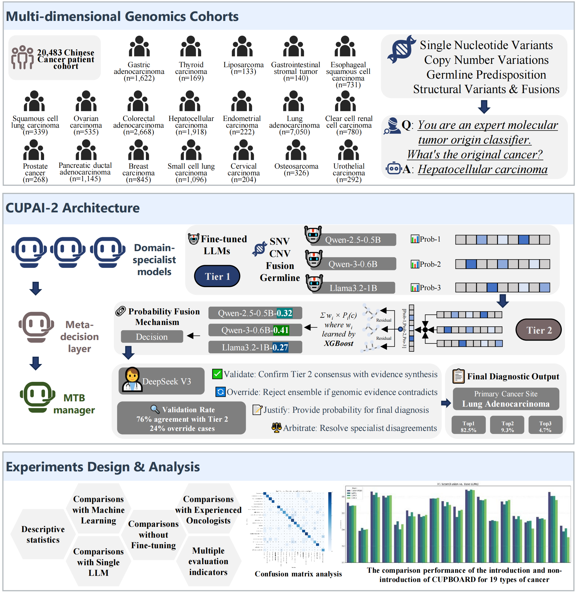
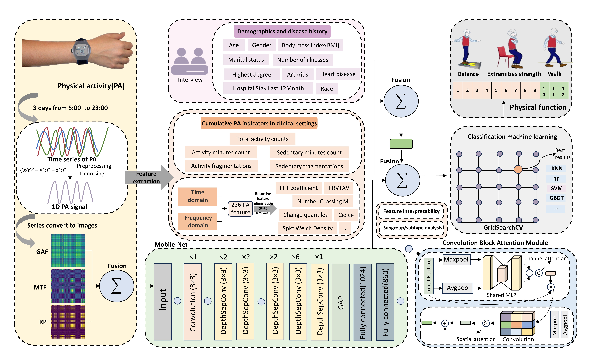
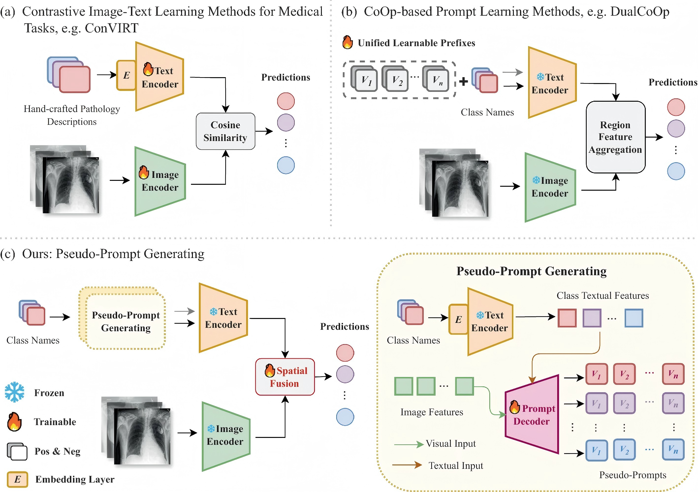








👋 Hi! I am Junjie Zhang. I am currently a Master's student at the Department of Computer Science and Technology, University of Science and Technology of China (USTC), supervised by <a href="http://staff.ustc.edu.cn/~huangzhy/" target="_blank">Prof. Zhenya Huang</a>, <a href="http://staff.ustc.edu.cn/~qiliuql/" target="_blank">Prof. Qi Liu</a>, and <a href="http://staff.ustc.edu.cn/~cheneh" target="_blank">Prof. Enhong Chen</a> at the <a href="https://cogskl.iflytek.com/" target="_blank">BDAA Lab</a>. Before that, I received my B.Eng. degree from the Department of Computer Science, Sichuan University in June 2025. Additionally, I will be joining Tencent for a joint academic-industry training program this upcoming summer.

🔬 My research primarily focuses on the cognition and mathematical reasoning of Large Language Models (LLMs), including exploring internal model features to evaluate reasoning correctness. I am also deeply engaged in interdisciplinary collaborations in bioinformatics and medical informatics. My work spans leveraging LLM multi-agent frameworks for cancer origin tracing, developing multimodal digital biomarkers using wearable sensors, and designing self-supervised calibration methods for robust model predictions. 

📬 I am always open to collaborations and academic exchanges, feel free to reach out via email: **polabread@mail.ustc.edu.cn**.

# 🎓 Education
- *2025.09 - 2028.06*,  **University of Science and Technology of China (USTC)**, Hefei, China. Master's Student in Computer Science and Technology. 
- *2021.09 - 2025.06*,  **Sichuan University (SCU)**, Chengdu, China. B.Eng. in Computer Science and Technology. 

# 📝 Publications & Patents

AACR 2026

- **CUPAI-2: A Collaborative Multi-Agent LLM Framework for Diagnosis of Cancer of Unknown Primary.** Junjie Zhang†, Lingjie Fan†, Anzhi Chen, Zheyi Ji, Kai Wang\*, Junhan Zhao\*. *American Association for Cancer Research (AACR), 2026* **(Oral Presentation)**. † Equal contribution; \* Corresponding authors

IEEE TIM 2024

- **PFIMPA: A Multimodal Approach to Predict Physical Function Impairment in Older Adults Using Physical Activity From Wrist-Worn Accelerometer.** Lingjie Fan, Junjie Zhang, Junhan Zhao, Fengyi Wang, Tao Luo, Tao Lin. *IEEE Transactions on Instrumentation and Measurement*, 2024. **(A1)** [[Web]](https://ieeexplore.ieee.org/document/10699357)

PRCV 2024

- **Pseudo-Prompt Generating in Pre-trained Vision-Language Models for Multi-Label Medical Image Classification.** Yaoqin Ye, Junjie Zhang, Hongwei Shi. *Pattern Recognition and Computer Vision (PRCV 2024)*, 2024. **(CCF-C)** [[Web]](https://link.springer.com/chapter/10.1007/978-981-97-8496-7_20) [[Github]](https://github.com/fallingnight/PsPG)

- 🔄*Under Review*, **CIPA: A Multimodal Deep Learning Fusion-Based Cognitive Impairment Monitoring Framework Driven by Motion Tracking Data.** Lingjie Fan, Junhan Zhao, Junjie Zhang, Xiyue Wang, Tao Lin., 2026.

- 🔄*Under Review*, **Face2MCI: A Deep Learning Framework for Mild Cognitive Impairment Detection from Facial Videos.** Lingjie Fan†, Junjie Zhang†, Zheming Zhang, Tao Lin, Tianchen Niu, Shengyi Liu, Leyang Tao, Xinyao Xia, Wenhuan Li, Yongji Wu, Fengyi Wang, Lauren Chan, Samuel L. Volchenboum\*, Junhan Zhao\*., 2026. † Equal contribution; \* Corresponding authors

- **From Physical Activity Patterns to Cognitive Status: Development and Validation of Novel Digital Biomarkers for Cognitive Assessment in Older Adults.** Lingjie Fan, Fengyi Wang, Junhan Zhao, Junjie Zhang, Yangan Li, Jia Tang, Tao Lin, Quan Wei. *International Journal of Behavioral Nutrition and Physical Activity*, 2025. **(A1)** [[Web]](https://link.springer.com/article/10.1186/s12966-025-01706-x)

- **Predicting Physical Functioning Status in Older Adults: Insights from Wrist Accelerometer Sensors and Derived Digital Biomarkers of Physical Activity.** Lingjie Fan, Junhan Zhao, Yao Hu, Junjie Zhang, Xiyue Wang, Fengyi Wang, Mengyi Wu, Tao Lin. *Journal of the American Medical Informatics Association (JAMIA)*, 2024. [[Web]](https://academic.oup.com/jamia/article/31/11/2571/7740005)

- **Multimodal Physical Fitness Monitoring (PFM) Framework Based on TimeMAE-PFM in Wearable Scenarios.** Junjie Zhang, Zheming Zhang, Huachen Xiang, Yangquan Tan, Linnan Huo, Fengyi Wang. *2024 5th International Conference on Computer Engineering and Application (ICCEA)*, 2024. **(EI)** [[Web]](https://ieeexplore.ieee.org/document/10604093)

- **Exploring Outdoor Activity Limitation (OAL) Factors Among Older Adults Using Interpretable Machine Learning.** Lingjie Fan, Junjie Zhang, Fengyi Wang, Shuang Liu, Tao Lin. *Aging Clinical and Experimental Research*, 2023. [[Web]](https://link.springer.com/article/10.1007/s40520-023-02461-4)

- **Ergonomic Load Differentiates Pediatric and Adult Physiotherapy: Ergonomic Differences Between Adult Physiotherapy and Pediatric Physiotherapy.** Yongji Wu, Shuang Liu, Junjie Zhang, Borui Jiang, Haitao Wang, Min Hu. *Proceedings of the 3rd International Conference on Human Machine Interaction (ICHMI)*, 2023. **(EI)** [[Web]](https://dl.acm.org/doi/10.1145/3604383.3604386)

### Patents & Software Copyrights
- **[Invention Patent]** Zero-shot Classification Algorithm for Chest Medical Images Based on Multimodal Contrastive Learning. (Patent No: 202410342039.5) 
- **[Software Copyright]** Intelligent Diagnostic VQA Software (Registration No: 2024SR0446319) 
- **[Software Copyright]** Intelligent VQA Diagnostic Assistant Software (Registration No: 2024SR0703994) 

# 💼 Internships
-  <i>2024.11 - 2025.05</i>, <strong>Baidu</strong>, Beijing, China. <i>Paddle Framework R&D Engineer (Deep Learning Platform Technology Dept.)</i>
-  <i>2024.10 - 2025.02</i>, <strong>Tsinghua University (Energy Internet Innovation Research Institute)</strong>, Chengdu, China. <i>Data Analyst</i>
-  <i>2024.01 - 2024.04</i>, <strong>Tsinghua University (Institute for AI Industry Research, AIR)</strong>, Beijing, China. <i>Research Assistant</i>
-  <i>2023.07 - 2023.08</i>, <strong>Tencent</strong>. <i>Selected for Tencent Rhino-Bird Open Source Talent Cultivation Program</i>

# 🏅 Honors and Awards
**2025**
- First-class Graduate Academic Scholarship, USTC 
- National 2nd Prize, "Huawei Cup" China Post-Graduate Mathematical Contest in Modeling 

**2024**
- Provincial Bronze Prize, "Challenge Cup" National College Students Entrepreneurship Plan Competition (2024.05) 
- Outstanding Camper, Tsinghua AIR Winter Camp (2024.03) 

**2023**
- Provincial 1st Prize, Huawei ICT Competition (2023.12) 
- Selected for Tencent Rhino-Bird Open Source Talent Cultivation Program (2023.08)
- Provincial 2nd Prize (Captain), Statistical Modeling Competition (2023.08) 

- 3rd Prize, "Diangong Cup" National Mathematical Modeling Contest (2023.07)
- Meritorious Winner (Captain), COMAP Mathematical Contest in Modeling (MCM/ICM) (2023.05) 
- Provincial 3rd Prize, Chinese Collegiate Computing Competition (2023.05)
- 2nd Prize, "Huazhong Cup" Mathematical Modeling Challenge (2023.05)
- 1st Prize, The 14th Chinese Mathematics Competitions (CMC) (2023.03) 
- Outstanding Award (Captain), "HuaShu Cup" International Mathematical Contest in Modeling (2023.01) 
- 1st Prize (Captain), Asia and Pacific Mathematical Contest in Modeling (APMCM) (2023.01) 
- *Scholarships & Titles:* Comprehensive A-Level Certificate of Sichuan Province, National Encouragement Scholarship, Guanxin Outstanding Student Scholarship, Huawei Smart Base Scholarship (2023.12).

**2022**
- Provincial 1st Prize (Captain), CUMCM (Contemporary Undergraduate Mathematical Contest in Modeling) (2022.10)
- Outstanding Student of Sichuan University (2022.10)
